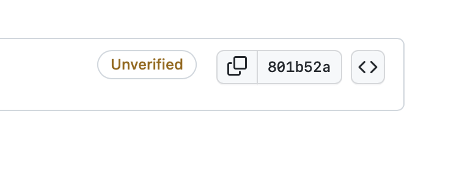
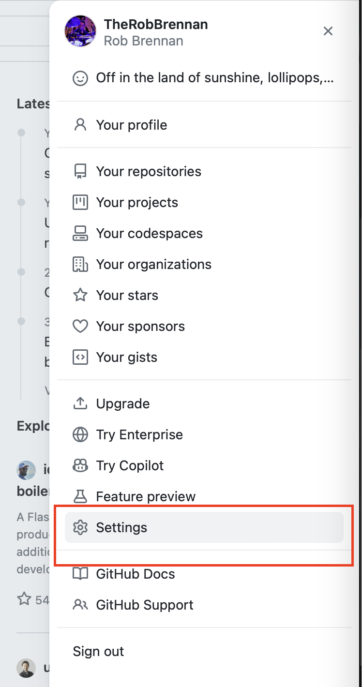
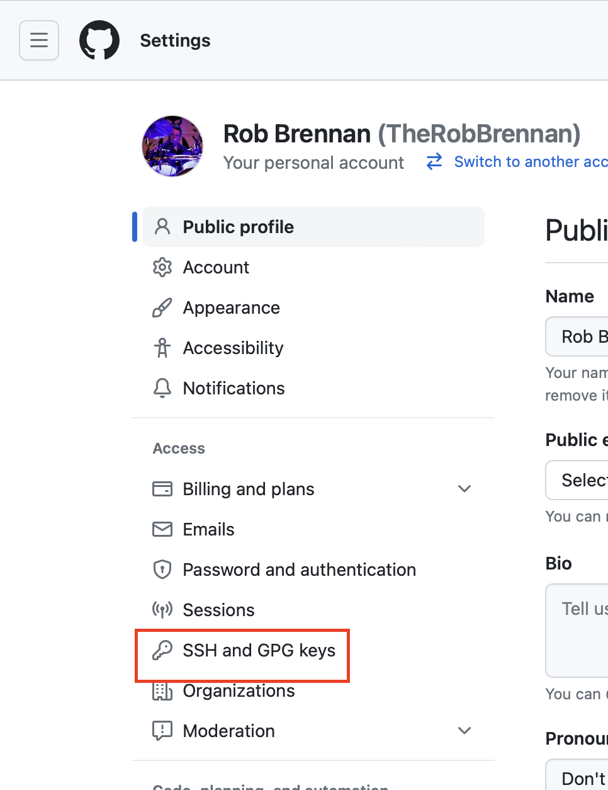
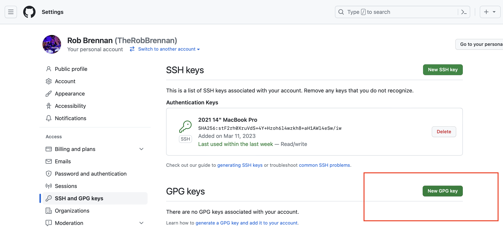
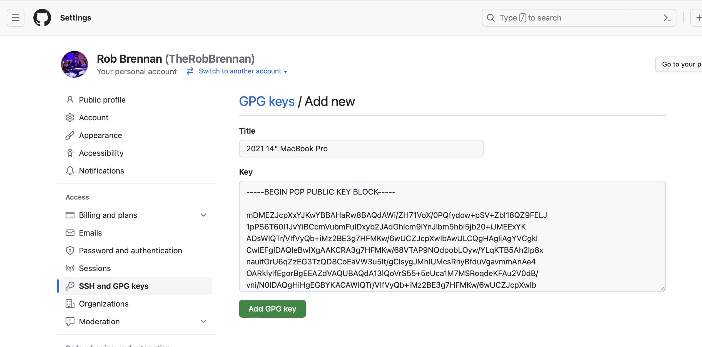
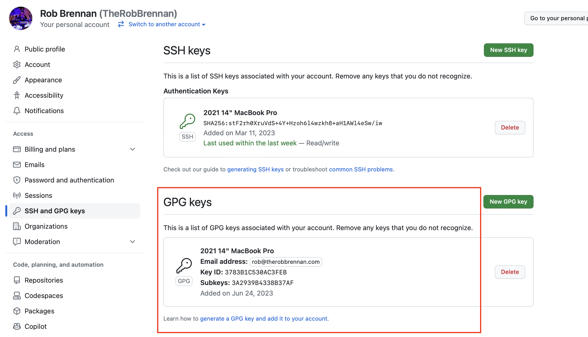
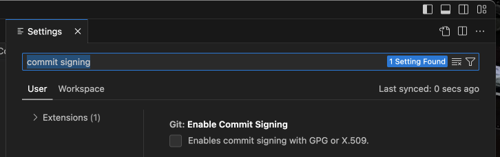

# Welcome
If you've ever encountered the dreaded `Unverified` appearing next to your commits and are developing on macOS, this guide is for you.



I went through the following steps on my 2021 14" MacBook Pro running `macOS Ventura 13.4.1 (22F82)` on `Apple M1 Max` silicon:

## Getting started

### Install GnuPG on macOS
```sh
# CHECK: Does GPG exist on your system? It's not included by default.
% gpg
zsh: command not found: gpg

# Let's follow the steps outlined in this guide to save us some pain - https://contributing.bitwarden.com/contributing/commit-signing/

# ASSUMPTION: Homebrew should be installed on your system
#   See https://brew.sh for quick and easy installation instructions

# Install GnuPG on macOS using Homebrew. It may take a few minutes. ☕️
% brew install gnupg

# Define a new GPG_TTY environment variable in your ZSH source file
% echo "export GPG_TTY=$(tty)" >> ~/.zshrc

# Source your ZSH source file for the new environment variable to take effect
% source ~/.zshrc

# OPTIONAL: Verify that you have access to the new environment variable
% echo ${GPG_TTY}
/dev/ttys005
```

### Configure GPG settings using GitHub documentation
Next, let's follow the documentation on GitHub about setting up GPG commit signature verification at [https://docs.github.com/en/authentication/managing-commit-signature-verification/about-commit-signature-verification#gpg-commit-signature-verification](https://docs.github.com/en/authentication/managing-commit-signature-verification/about-commit-signature-verification#gpg-commit-signature-verification):

```sh
# Step 01 - Check for existing GPG keys - https://docs.github.com/en/authentication/managing-commit-signature-verification/checking-for-existing-gpg-keys
% gpg --list-secret-keys --keyid-format=long
gpg: directory '/Users/xxxxxxxxxx/.gnupg' created
gpg: /Users/xxxxxxxxxx/.gnupg/trustdb.gpg: trustdb created

# Step 02 - Check the command output to see if you have a GPG key pair
% gpg --armor --export 3AA5C34371567BD2
gpg: WARNING: nothing exported
```

As expected, I installed GnuPG on macOS and have not generated a GPG key pair. Let's do that now.

#### Generate a new GPG key
Let's follow the guide at [https://docs.github.com/en/authentication/managing-commit-signature-verification/generating-a-new-gpg-key](https://docs.github.com/en/authentication/managing-commit-signature-verification/generating-a-new-gpg-key)

```sh
# Generate a GPG key pair
# In this example, I'm going to use the defaults and select a passphrase
% gpg --full-generate-key
```

Now we need to list the long form of GPG keys for which you have both a public and private key. We will need to use our private key for signing commits or tags.

```sh
# List the long form of our GPG keys
% gpg --list-secret-keys --keyid-format=long
gpg: checking the trustdb
gpg: marginals needed: 3  completes needed: 1  trust model: pgp
gpg: depth: 0  valid:   1  signed:   0  trust: 0-, 0q, 0n, 0m, 0f, 1u
[keyboxd]
---------
sec   ed25519/3783B1C530AC3FEB 2023-06-24 [SC]
      EBFD521F57241BFA2333D8113783B1C530AC3FEB
uid                 [ultimate] Rob Brennan <rob@therobbrennan.com>
ssb   cv25519/3A2939B4338B37AF 2023-06-24 [E]
```

From the list of GPG keys, copy the long form of the GPG key ID you'd like to use. In this example, the GPG key ID is `EBFD521F57241BFA2333D8113783B1C530AC3FEB`.

Paste the text below, substituting the GPG key ID you'd like to use. In this example, the GPG key ID is `EBFD521F57241BFA2333D8113783B1C530AC3FEB`.

```sh
% gpg --armor --export EBFD521F57241BFA2333D8113783B1C530AC3FEB
-----BEGIN PGP PUBLIC KEY BLOCK-----

mDMEZJcpXxYJKwYBBAHaRw8BAQdAWi/ZH71VoX/0PQfydow+pSV+ZbI18QZ9FELJ
1pPS6T60I1JvYiBCcmVubmFuIDxyb2JAdGhlcm9iYnJlbm5hbi5jb20+iJMEExYK
ADsWIQTr/VIfVyQb+iMz2BE3g7HFMKw/6wUCZJcpXwIbAwULCQgHAgIiAgYVCgkI
CwIEFgIDAQIeBwIXgAAKCRA3g7HFMKw/68VTAP9NQdpobLOyw/YLqKTB5Ah2lp8x
nauitGrU6qZzEG3TzQD8CoEaVW3u5lt/gClsygJMhIUMcsRnyBfduVgavmmAnAe4
OARklylfEgorBgEEAZdVAQUBAQdA13lQoVrS55+5eUca1M7MSRoqdeKFAu2V0dB/
vni/N0IDAQgHiHgEGBYKACAWIQTr/VIfVyQb+iMz2BE3g7HFMKw/6wUCZJcpXwIb
DAAKCRA3g7HFMKw/63LdAQCBY0JI4oW9yGt70M7D5yeiY4R7gzHByhZyQ+Sbx3Tw
GAEAqzakEtQg17J1v+wapW91IGQ9aw2MRMXCu5mxLvtM7wM=
=BzL9
-----END PGP PUBLIC KEY BLOCK-----
```

#### Add a GPG key to your GitHub account
Let's follow the guide at [Adding a GPG key to your GitHub account](https://docs.github.com/en/authentication/managing-commit-signature-verification/adding-a-gpg-key-to-your-github-account).

Let's navigate to our GitHub account settings:


Select `SSH and GPG keys` underneath the `Access` section:


Let's create a new GPG key using the public key we generated previously:




We are now ready to commit using our new GPG key. Well, almost. There's one more step to go, and then we are done.

### Configure git to securely commit our code
We are almost there. There is one final step from our original guide at [https://contributing.bitwarden.com/contributing/commit-signing/](https://contributing.bitwarden.com/contributing/commit-signing/).

Let's update git to securely commit our code globally:

```sh
# Let's find the example key ID we want to sign our commits with
% gpg --list-secret-keys --keyid-format LONG
[keyboxd]
---------
sec   ed25519/3783B1C530AC3FEB 2023-06-24 [SC]
      EBFD521F57241BFA2333D8113783B1C530AC3FEB
uid                 [ultimate] Rob Brennan <rob@therobbrennan.com>
ssb   cv25519/3A2939B4338B37AF 2023-06-24 [E]

# Let's use the example key ID 'EBFD521F57241BFA2333D8113783B1C530AC3FEB' as our signing key
# OPTIONAL: Remove the --global flag to only apply this setting to the current repository
% git config --global user.signingkey EBFD521F57241BFA2333D8113783B1C530AC3FEB
% git config --global commit.gpgSign true

# Let's make sure we don't have any settings that might be defaulting to using SSH for signing, etc.
% git config --global --unset gpg.format
```

If you're using VS Code and committing using the GUI, please be sure to open your `Settings` and `Enable commit signing`



Let's see if this works...


Huzzah!!!! 🎉
